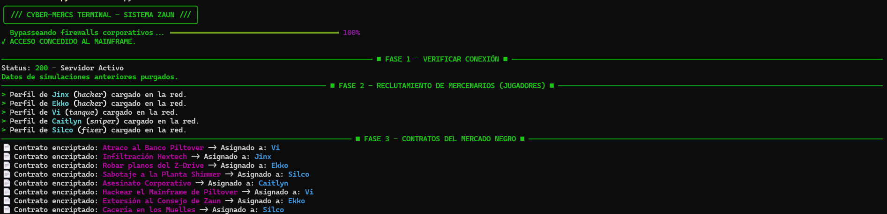
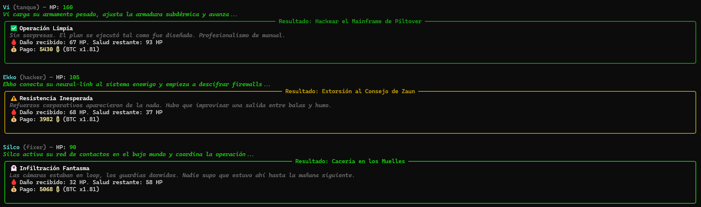
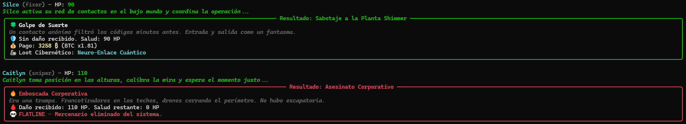

# Cyber-Mercs Corporation

Simulador RPG cyberpunk donde una corporacion dirige mercenarios del bajo mundo para ejecutar contratos letales. Cada clase tiene afinidad con ciertos tipos de misión, un motor RNG de 7 eventos decide el destino de cada operación, y los pagos se multiplican con el precio real de Bitcoin.

## Tech Stack

| Capa | Tecnologia |
|---|---|
| Servidor | FastAPI + Uvicorn |
| Persistencia | SQLite (4 tablas: mercs, contratos, comunicaciones, implantes) |
| Economía | Precio real de Bitcoin via CoinGecko API |
| HTTP async | httpx (no bloquea el event loop) |
| Motor RNG | Afinidad clase/contrato, 7 eventos, distribuciones ponderadas |
| Cliente | Rich (tablas, paneles, barras de progreso, narrativa) |
| POO | Herencia (Hacker y Tanque heredan de una clase base) + Factory Pattern |
| Auth | API Key via header `X-API-KEY` |
| Tests | pytest + FastAPI TestClient |

## Requisitos Previos

- Python 3.10+
- pip

## Instalacion

```bash
# Instalar dependencias
pip install -r requirements.txt

# Configurar variables de entorno
cp .env.example .env
# Editar .env si el usuario quiere cambiar la API Key o la URL de crypto
```

## Como Ejecutar

### Fase 1: Levantar el servidor

```bash
uvicorn main:app --reload
```

El servidor arranca en `http://localhost:8000`. En la terminal se verá:

```
INFO - Tablas de la corporacion verificadas/creadas.
INFO - DB vacia: datos semilla insertados.
INFO - Uvicorn running on http://127.0.0.1:8000
```

### Fase 2: Ejecutar el cliente (en otra terminal)

```bash
python cliente.py
```

El sistema simula 8 misiones con 5 mercenarios. El usuario sólo observa la ejecución.



## Clases de Mercenarios

| Clase | HP Base | Habilidad |
|---|---|---|
| Hacker | 100 | Recibe mitad de daño en hackeo/infiltración |
| Tanque | 200 | Armadura subdérmica absorbe 10 pts en combate/asalto |
| Sniper | 110 | Sin habilidad especial (afinidad en infiltración) |
| Fixer | 90 | Sin habilidad especial (afinidad en sabotaje/hackeo) |
| Novato | 100 | Sin bonificaciones |

## Sistema RNG (7 Eventos)

Cada contrato ejecutado genera un evento según la **afinidad** entre la clase del mercenario y el tipo de misión:

| Evento | Daño | Pago | Efecto Especial |
|---|---|---|---|
| Jackpot Corporativo | 0x | 2x | Implante garantizado |
| Golpe de Suerte | 0x | 1x | +30% chance implante |
| Infiltración Fantasma | 0.5x | 1x | — |
| Operacion Limpia | 1x | 1x | — |
| Resistencia Inesperada | 1.25x | 1x | — |
| Emboscada Corporativa | 1.5x | 1x | — |
| Desastre Absoluto | 2x | 0x | Misión fallida, sin pago |

**Distribuciones por afinidad:**

| Perfil | Jackpot | Suerte | Fantasma | Limpia | Resistencia | Emboscada | Desastre |
|---|---|---|---|---|---|---|---|
| Fuerte | 10% | 20% | 25% | 25% | 10% | 8% | 2% |
| Neutral | 5% | 10% | 20% | 30% | 15% | 15% | 5% |
| Debil | 2% | 5% | 10% | 25% | 20% | 25% | 13% |

**Modificador de salud:** si el mercenario tiene menos del 60% de HP, su afinidad se degrada (fuerte -> neutral -> débil).

## Misiones

El cliente ejecuta 8 contratos que cubren diferentes combinaciones de afinidad:

| Mision | Tipo | Mercenario | Afinidad |
|---|---|---|---|
| Atraco al Banco Piltover | asalto | Vi (tanque) | Fuerte |
| Infiltracion Hextech | infiltracion | Jinx (hacker) | Fuerte |
| Robar planos del Z-Drive | hackeo | Ekko (hacker) | Fuerte |
| Sabotaje a la Planta Shimmer | sabotaje | Silco (fixer) | Fuerte |
| Asesinato Corporativo | asalto | Caitlyn (sniper) | Débil |
| Hackear el Mainframe de Piltover | hackeo | Vi (tanque) | Débil |
| Extorsion al Consejo de Zaun | combate | Ekko (hacker) | Neutral |
| Caceria en los Muelles | combate | Silco (fixer) | Débil |

Los mercenarios conservan su HP entre misiones. Si un mercenario muere, sus misiones restantes se abortan automáticamente.



## Narrativa Contextual

Cada mision incluye:

1. **Intro por clase** — el mercenario se presenta según su especialidad antes de cada operación.
2. **Evento RNG con narrativa** — cada uno de los 7 eventos tiene su propia historia.
3. **Variante vivo/muerto** — si el mercenario sobrevive lee una versión del evento; si muere, lee otra completamente distinta.



## Endpoints del Servidor

### Publicos (sin API Key)

| Método | Ruta | Descripción |
|---|---|---|
| GET | `/` | Health check |
| GET | `/mercs/` | Lista todos los mercenarios |
| GET | `/comunicaciones/{alias}` | Mensajes recibidos por un merc |
| GET | `/implantes/{alias}` | Inventario de implantes |
| GET | `/contratos/mercenario/{alias}` | Contratos de un merc |

### Protegidos (requieren `X-API-KEY`)

| Método | Ruta | Descripción |
|---|---|---|
| POST | `/mercs/` | Registrar mercenario |
| PUT | `/mercs/{alias}/estado` | Cambiar estado vital |
| POST | `/contratos/` | Publicar contrato |
| POST | `/contratos/{id}/ejecutar` | Ejecutar contrato (RNG + crypto) |
| POST | `/contratos/{id}/fallar` | Abortar contrato |
| POST | `/comunicaciones/` | Enviar mensaje |
| DELETE | `/reset` | Reiniciar DB con datos semilla |

## Base de Datos (SQLite)

4 tablas relacionadas con Foreign Keys:

| Tabla | Campos | Relación |
|---|---|---|
| `mercs` | alias (PK), clase_nombre, hp, creditos, estado_vital | — |
| `contratos` | id (PK), titulo, tipo_contrato, mercenario_asignado (FK), dano_estimado, pago_base, estado | → mercs |
| `comunicaciones` | id (PK), remitente, destinatario, contenido, timestamp | — |
| `implantes` | id (PK), mercenario_alias (FK), nombre_implante, UNIQUE(alias+implante) | → mercs |

- Las conexiones usan **context managers** (commit automático o rollback en error).
- El constraint **UNIQUE** en implantes evita que un mercenario acumule duplicados del mismo implante.

## Arquitectura

```
cliente.py                              (Rich UI + narrativa)
    |
    | HTTP (requests)
    v
main.py                                 (FastAPI — logica de negocio)
    |
    +----+------+----------+----------+
    |    |      |          |          |
 rng.py  agente.py  db.py    config.py
 (Motor   (POO:     (SQLite    (.env
  RNG,     Hacker,   4 tablas,   API Key,
  7 evts)  Tanque,   ctx mgr,   CoinGecko
           Factory)  atomico)    URL)

tests/
  conftest.py  ── DB temporal aislada (no toca mercenarios.db)
  test_api.py  ── 8 tests via FastAPI TestClient
```

**Flujo de un contrato:**

1. Cliente envía `POST /contratos/{id}/ejecutar`
2. Servidor calcula afinidad (clase mercenario vs tipo contrato)
3. Si HP < 60%, la afinidad se degrada
4. Se elige un evento RNG según la distribución de afinidad
5. La clase del mercenario modifica el daño (Hacker: /2 en hackeo, Tanque: -10 en combate)
6. Si HP llega a 0 -> FLATLINE (muerto, misiones pendientes se abortan)
7. Si sobrevive -> consulta precio real de BTC a CoinGecko
8. Multiplica pago base x multiplicador crypto x multiplicador del evento
9. Chance de obtener implante cibernético como loot (60%, 90% o 100% segun evento)

## Tests

```bash
python -m pytest tests/ -v
```

Los tests usan una DB temporal aislada (no tocan `mercenarios.db`):

```
tests/test_api.py::test_registrar_merc_sin_api_key_retorna_401  PASSED ✅
tests/test_api.py::test_registrar_merc_con_api_key_retorna_200  PASSED ✅
tests/test_api.py::test_validador_hp_negativo_retorna_422       PASSED ✅
tests/test_api.py::test_validador_clase_invalida_retorna_422    PASSED ✅
tests/test_api.py::test_validador_tirada_fuera_de_rango         PASSED ✅
tests/test_api.py::test_alias_duplicado_retorna_409             PASSED ✅
tests/test_api.py::test_flujo_contrato_completo                 PASSED ✅
tests/test_api.py::test_raiz_retorna_200                        PASSED ✅
```

## Tabla Final

Al terminar la simulacion, el sistema muestra un tablero con el estado de todos los mercenarios: alias, clase, estado vital, barra de HP visual, créditos acumulados e implantes ciberneticos obtenidos.


## Estructura del Proyecto

```
Cyber_Mercs/
├── main.py                 Servidor FastAPI (12 endpoints, lifespan)
├── rng.py                  Motor RNG (afinidad, 7 eventos, implantes)
├── agente.py               Clases POO (Hacker, Tanque + Factory Pattern)
├── db.py                   Capa de persistencia SQLite (context manager, ops atomicas)
├── config.py               Variables de entorno (.env)
├── cliente.py              Simulacion autonoma con narrativa (Rich)
├── .env                    Variables de entorno (no se sube a git)
├── .env.example            Plantilla de .env
├── requirements.txt        Dependencias Python
└── tests/
    ├── conftest.py         DB temporal aislada para tests
    └── test_api.py         8 tests automatizados
```

---

<p align="center">
  <strong>Creado con dedicación por Doris Mosquera L.</strong><br>
  ♥ Hecho con código, café y mucho amor ♥
</p>
