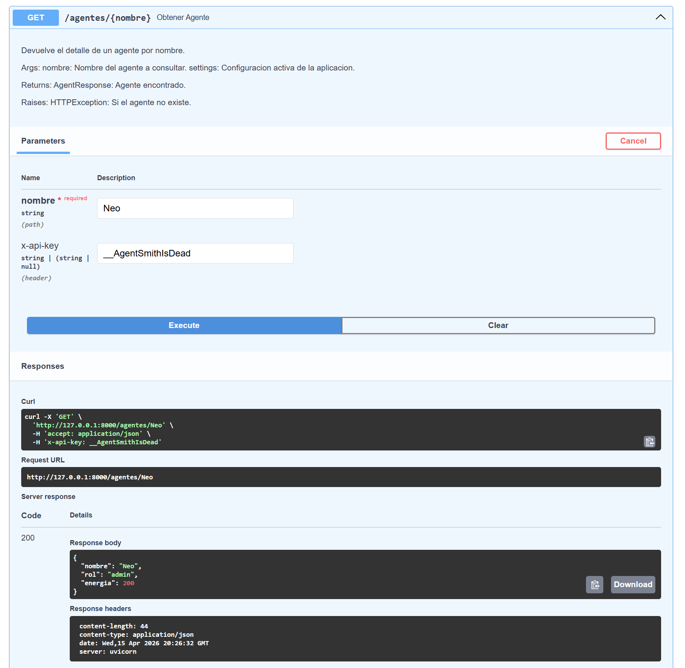
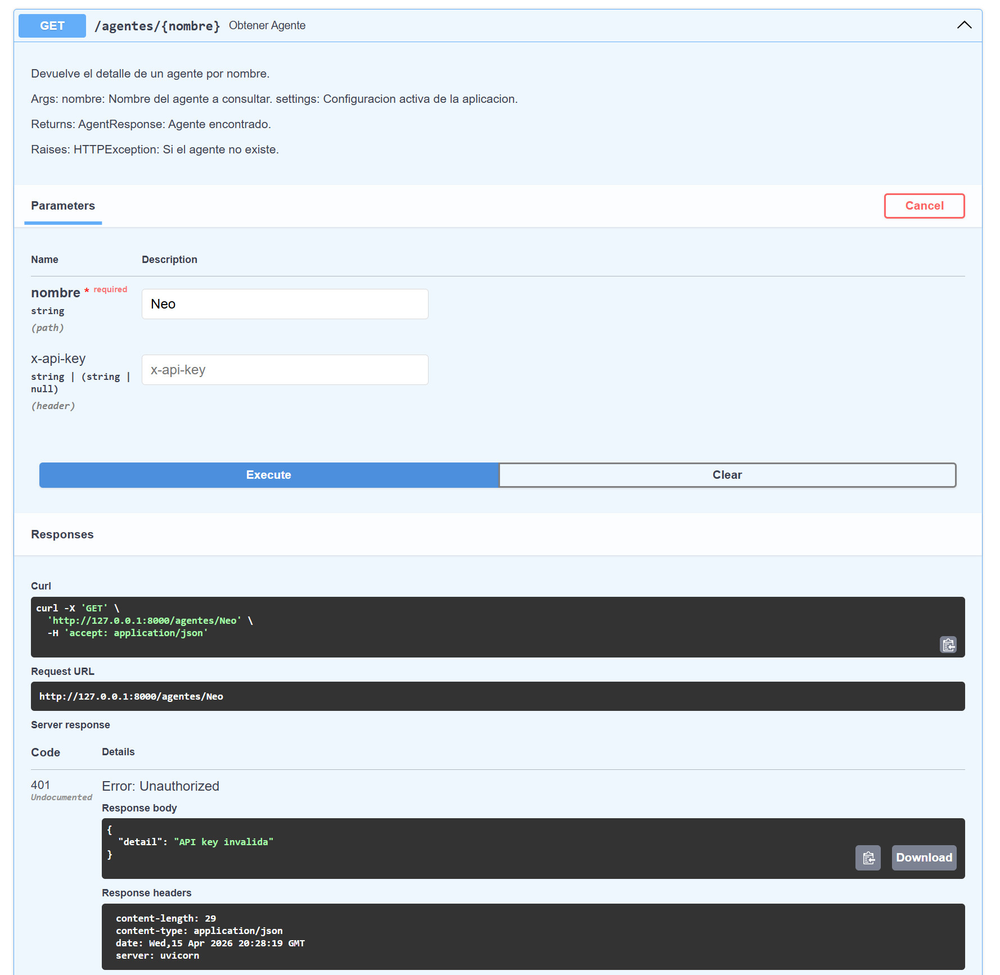
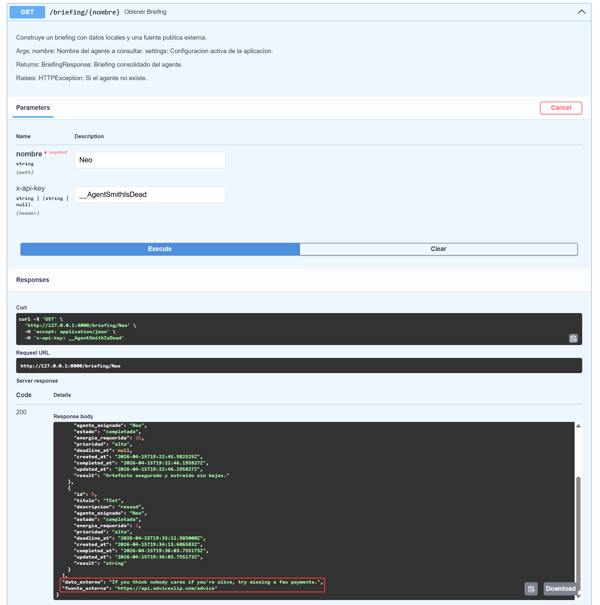

# Reto Final Python

API de una agencia de agentes construida con FastAPI, SQLite, autenticación por API key y enriquecida con una API pública externa.

## Requisitos

- Python 3.10 o superior
- Dependencias listadas en `requirements.txt`

## Configuración

1. Crear un archivo `.env` a partir de `.env.example`.
2. Configurar las variables necesarias.

Variables esperadas:

- `AGENCIA_API_KEY`
- `EXTERNAL_API_URL`
- `DATABASE_PATH`
- `EXTERNAL_API_TIMEOUT`

## Instalación y ejecución

1. Instalar dependencias:

```bash
pip install -r requirements.txt
```

2. Levantar la API con Uvicorn:

```bash
uvicorn main:app --reload
```

3. Ejecutar el cliente de demostración en otra terminal:

```bash
python cliente.py
```

El cliente crea varios agentes, registra misiones, completa una de ellas, envía mensajes, consulta briefings y elimina un agente que aún tiene misiones activas.

## Inicialización de la base de datos

Al arrancar el API, el proyecto revisa si el archivo definido en `DATABASE_PATH` ya existe. Si no existe, se crea el archivo SQLite, se crean las tablas y se cargan datos semilla para facilitar pruebas iniciales.

La carga inicial incluye 3 agentes, 5 mensajes y 3 misiones con estados distintos (`pendiente`, `en_curso` y `completada`). Estos datos son diferentes a los que crea [cliente.py](C:\Users\hector.morales\Learn Python\Sofka Fundamentos\reto-final-python\cliente.py) para que el demo manual y los datos semilla no se mezclen.

Si el archivo de la base ya existe, la inicialización no inserta nada nuevo.

## Endpoints

| Método | Ruta | Protegido | Descripción |
|---|---|---|---|
| `GET` | `/` | No | Verifica que la API esté disponible. |
| `GET` | `/agentes/{nombre}` | Sí | Consulta un agente por nombre. |
| `GET` | `/agentes/` | Sí | Lista todos los agentes registrados. |
| `POST` | `/agentes/` | Sí | Crea un agente. |
| `PUT` | `/agentes/{nombre}` | Sí | Actualiza rol y energía de un agente. |
| `DELETE` | `/agentes/{nombre}` | Sí | Elimina un agente y marca como fallidas sus misiones activas. |
| `POST` | `/mensajes` | Sí | Registra un mensaje entre agentes. |
| `GET` | `/mensajes/{nombre}` | Sí | Lista mensajes recibidos por un destinatario. |
| `POST` | `/misiones/` | Sí | Crea una misión para un agente existente. |
| `GET` | `/misiones/{mision_id}` | Sí | Consulta una misión por identificador. |
| `GET` | `/agentes/{nombre}/misiones` | Sí | Lista las misiones asignadas a un agente. |
| `POST` | `/misiones/{mision_id}/completar` | Sí | Completa una misión y descuenta energía según la clase del agente. |
| `GET` | `/briefing/{nombre}` | Sí | Devuelve un briefing combinado con datos locales y Advice Slip. |

## Observabilidad

El servidor usa el módulo estándar `logging` configurado en `main.py` con nivel por defecto `INFO` y formato con fecha, nivel y mensaje.

- `INFO` se usa para eventos operativos normales como crear agentes, registrar mensajes y completar misiones.
- `WARNING` se usa para degradaciones controladas o situaciones anormales que no rompen el flujo, por ejemplo autenticación fallida, consultas de recursos inexistentes o activación del fallback del briefing externo.
- `ERROR` y `exception` se reservan para fallos reales del servidor, como problemas con SQLite o excepciones no controladas.

## Seguridad

Todos los endpoints están protegidos con `X-API-KEY`, a excepción de `GET /`, para que el chequeo de si el API está arriba se pueda hacer de manera pública. El resto de los endpoints son sensibles y la información en ninguno de ellos debe ser pública.

## Eliminación de agentes

Cuando se elimina un agente con `DELETE /agentes/{nombre}`, la API primero busca sus misiones en estado `pendiente` o `en_curso` y las marca como `fallida`. En el campo `result` se guarda la razón de negocio: el agente asignado fue eliminado del sistema.

Esta estrategia evita dejar misiones activas huérfanas y conserva trazabilidad operativa. Las misiones ya `completada` o previamente `fallida` no se modifican.

## Decisiones de ingeniería

### 1. Esquema de la tabla misiones

Mantengo las columnas sugeridas por el reto y uso `prioridad`, `deadline_at`, `created_at`, `completed_at`, `updated_at` y `result` porque permiten mantener datos relevantes de la misión y auditar su ciclo de vida sin agregar complejidad. `result` deja trazabilidad del desenlace cuando una misión se completa o se marca como fallida.

Las fechas se almacenan como `TEXT` en formato ISO 8601 porque es legible, portable y suficiente para ordenar, mostrar y serializar fechas en una API sencilla sin agregar complejidad.

### 2. API pública elegida

La API pública elegida es `https://api.adviceslip.com/advice`, que devuelve un consejo breve sin requerir autenticación. Encaja con la narrativa porque puede leerse como una recomendación táctica o una pieza de inteligencia rápida para el agente antes o después de una operación.

En el briefing aporta un valor narrativo y funcional, ya que el consejo externo complementa los datos locales del agente y de sus misiones, haciendo que el endpoint entregue algo más que información de base de datos.

### 3. Estrategia de resiliencia

Si la API externa falla, responde lento o devuelve un formato inesperado, el endpoint `/briefing/{nombre}` no devuelve un error sino que responde con los datos locales del agente y un mensaje de fallback en `dato_externo`.

Esta decisión evita que, a causa de un tercero, deje de funcionar toda la API. Además, la información crítica sigue estando en la base de datos interna.

También se configura un timeout explícito, definido en `EXTERNAL_API_TIMEOUT`, para impedir bloqueos indefinidos y se registra el incidente con `logging`.

## Referencias consultadas

### Pydantic
- Pydantic models: [https://docs.pydantic.dev/latest/concepts/models/](https://docs.pydantic.dev/latest/concepts/models/)
- Pydantic fields: [https://docs.pydantic.dev/latest/concepts/fields/](https://docs.pydantic.dev/latest/concepts/fields/)

### Logging
- Python logging: [https://docs.python.org/3/library/logging.html](https://docs.python.org/3/library/logging.html)
- Logging in Python: [https://realpython.com/python-logging/](https://realpython.com/python-logging/)

### API Externa
- Advice Slip API: [https://api.adviceslip.com/](https://api.adviceslip.com/)

## Evidencias

### Consumo de API definiendo llave


### Consumo de API sin definir llave


### Consumir briefing

